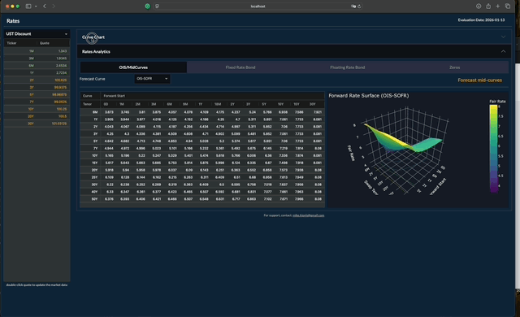
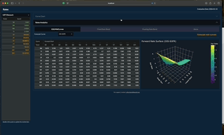
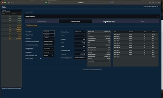
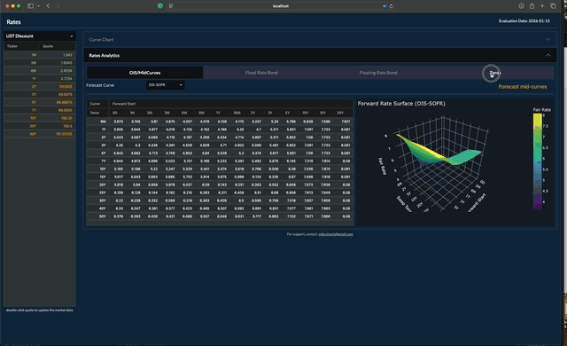

A Dash-based wrapper for QuantLib


To build and run:
```
python3 -m venv .venv
source .venv/bin/activate
python -m pip install --upgrade pip setuptools wheel
pip install -r requirements.txt
gunicorn rates:server --bind 0.0.0.0:8050
```

To run in the docker:
```
docker build -t rates-app .
docker run -e DASH_HOST=0.0.0.0 -p 8050:8050 rates-app
```

Use cases:
Update an individual market data input of an OIS forecast curve to trigger recalculation of all remaining curve tenors and automatic repricing of dependent mid curves.



Specify the tenor of the fixed-rate bond and press Enter to initialize the bond term structure and price it at par. Update the bond price to recalculate the yield and all dependent risk measures; update the yield to recalculate the price and associated measures. Change the discount curve to recalculate the z-spread and all other dependent analytics.



Specify the tenor of the floating-rate bond and press Enter to initialize the bond term structure and price it at par.   Change the forecast curve to to calculate the yield and all dependent risk measures; Update the bond price or spread to recalculate the yield and all dependent risk measures; update the yield to recalculate the price and associated measures. Change the discount curve to recalculate the z-spread and all other dependent analytics.



Specify the tenor to generate a set of zero-coupon bonds. Specify and update the discount curve to recalculate the bond prices, yields, and all dependent analytics.


