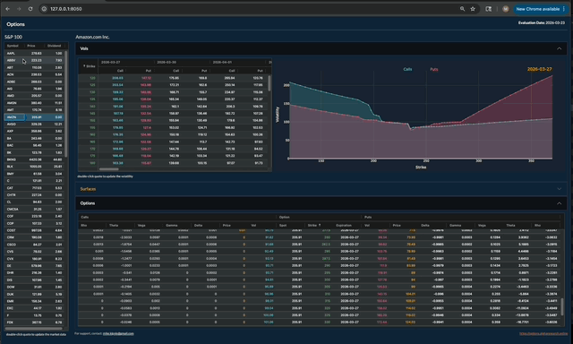
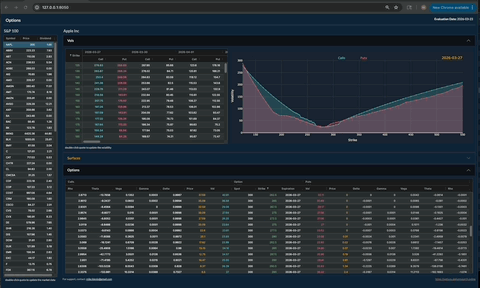
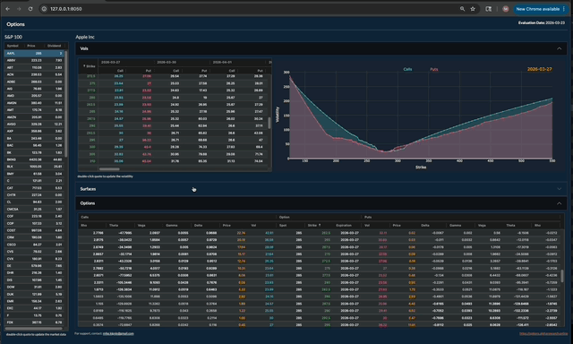
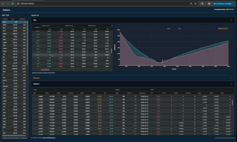
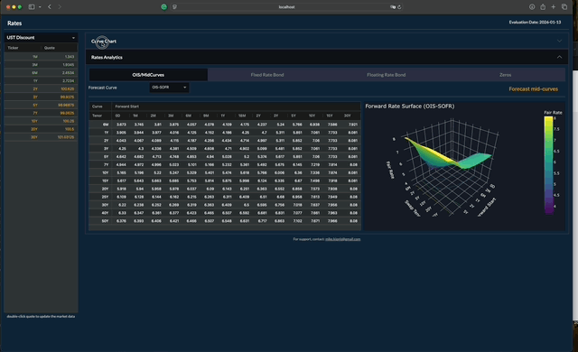
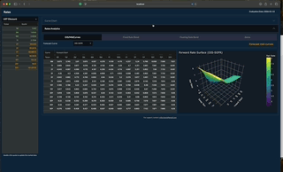
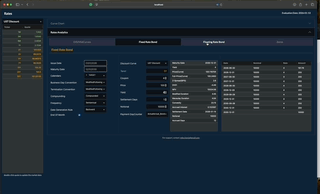
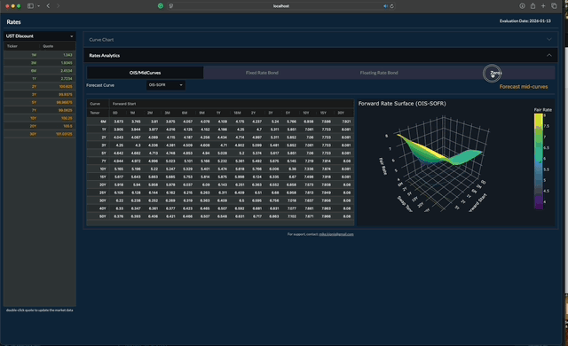

## Plotly/Dash wrapper for QuantLib

Plotly Dash provides a Python-native framework for building reactive, browser-based analytical applications without requiring JavaScript or frontend frameworks. By combining Dash’s reactive UI model with QuantLib’s pricing engines, we can deliver compact, extensible analytical tools implemented entirely in Python.


## Dev Guide (Options)

#### Live App: [https://options.plotly.app](https://options.plotly.app)

### Objective
The goal of this section of the document is to go over an interactive stock options pricing system that exposes QuantLib’s pricing engines through a browser-based interface. The application integrates QuantLib for instrument construction and valuation with Plotly Dash for reactive UI and visualization.

### Functionality

The application allows the user to select an underlying instrument, automatically retrieve the relevant volatilities, and display the volatility smiles and surfaces on the screen. It then prices the options and calculates the Greeks. When the user updates the underlying prices or volatilities, the system recalculates the option prices and Greeks in real time.

Key functionalities:

* User selects an underlying instrument.
* System retrieves market volatilities for the selected instrument.
* Displays volatility smiles and surfaces visually.
* Prices options and computes Greeks (Delta, Gamma, Vega, Theta, Rho).
* Updates prices and Greeks dynamically when inputs change



### Dataflow

#### Startup

Upon application startup or page reload, the following callback is invoked. This callback sets QuantLib’s evaluation date, retrieves the relevant market data, and outputs the sample data:

```
@app.callback( 
     Output("eval-date", "children"), 
     Output("underlying-symbol-market-data", "data"), 
     Output("vol-market-data", "data"), 
     Output("risk-free-rates", "data"), 
     Input("startup", "n_intervals"), 
) 
def setup_options_monitor(_): 
    debug_messages = [] 
    underlying_symbol_data = [] 
    risk_free_rates = []
```

#### Ouputs

**Output("eval-date", "children")** Displays the current QuantLib evaluation date in the top-right corner of the screen. This ensures all pricing and risk calculations are clearly tied to a specific valuation date.

**Output("underlying-symbol-market-data", "data")** Populates the Underlying Market Data panel (S&P 100 universe) with the latest prices and dividend information, providing the foundational inputs required for option valuation.

**Output("vol-market-data", "data")** Initializes the Volatility Panel with the default volatility market data, which is used to construct the volatility surface for pricing and risk calculations.

**Output("risk-free-rates", "data")** Propagates the risk-free rate data to the Options Panel, where it is used as a core input in option pricing models.

#### Underlying symbol market data (S&P 100)

The Underlying Symbol Market Data panel consumes **"underlying-symbol-market-data"** and displays the symbols, prices, and dividends in a grid. Upon selecting an underlying symbol, the selection is propagated to other components in the application. The panel also allows users to modify prices and dividends, enabling dynamic option repricing.

[UnderlyingSymbolMarketDataPanel.py](Common/Components/UnderlyingSymbolMarketDataPanel.py)



### Callbacks

#### Market Data Grid - Consumer
```
@self.app.callback( 
      Output(self.user_market_data_id, "data"), 
      Input("underlying-symbol-market-data", "data"), 
      State(self.user_market_data_id, "data"), 
      Input(self.market_data_grid_id, "rowData"), 
      prevent_initial_call=True ) 
def on_market_data_update(portal_market_data, user_market_data, row_data):
```

#### Market Data Grid - Producer - Symbol selector, price, dividend updates
```
@self.app.callback( 
      Output("selected-underlying-symbol", "data"), 
      Input(self.market_data_grid_id, "selectedRows"), 
      Input(self.market_data_grid_id, "cellValueChanged"), 
      State("selected-underlying-symbol", "data"), 
      prevent_initial_call=True ) 
def on_row_selected_updated(selected_rows, user_market_data, current_symbol):
```

#### Output
**Output("selected-underlying-symbol", "data")** - Returns the selected underlying symbol, including its current price and dividend, which are used as inputs in the option pricing calculations.

## Volatility Panel
The Volatility Panel consumes **"vol-market-data"** and **"selected-underlying-symbol"** as inputs. It displays the volatility surface both in a grid and in a chart. Users can update volatility values directly in the grid and select different expiration dates by clicking on the corresponding columns.

[VolPanel.py](Vol/VolPanel.py)



#### Callbacks

#### Volatility Grid Data - Consumer
```
@self.app.callback( 
      Output("expiration-dates", "data"), 
      Output(self.vol_panel_grid_id, "columnDefs"), 
      Output(self.vol_panel_grid_id, "rowData"), 
      Input("selected-underlying-symbol", "data"), 
      Input("vol-market-data", "data"), ) 
def populate_underlying_symbol_vol_data(underlying_symbol, vols):
```

#### Volatility Grid Data - Expiration Date Change
```
@self.app.callback( 
      Output("selected-expiration-date", "data"), 
      Input(self.vol_panel_grid_id, "cellClicked"), 
      Input("expiration-dates", "data"), 
      State("selected-expiration-date", "data"), 
      prevent_initial_call=True, ) 
def on_cell_clicked(cell, expiration_dates, current_expiration_date):
```

#### Volatility Grid Data - Producer - Volatilities
```
@self.app.callback( 
      Output("selected-expiration-vols", "data"), 
      Output("vol-panel-graph", "figure"), 
      Input("selected-expiration-date", "data"), 
      Input(self.user_vol_market_data_id, "data"), 
      prevent_initial_call=True, ) 
def update_graph(expiration_date, user_market_data):
```

### Outputs
**Output(”selected-expiration-vols”, “data”)** - Returns the volatilities for a given expiration date, which are used as inputs in the option pricing calculations.

## Options Panel
The Options Panel consumes **"underlying-symbol-market-data"**, **"selected-expiration-vols"**, and **"risk-free-rates"** as inputs. It initializes the option contracts for the selected expiration and strikes, then calls the pricing model to compute the option price and Greeks for each specified strike.

[OptionsPanel.py](Vol/OptionsPanel.py)



### Callbacks

#### Options - Setup options - Straddle
```
 @self.app.callback(
            Output("options-panel-grid", "rowData"),
            Output(f"{self.prefix}-reset-scroll", "data"),
            Input(f"{self.prefix}-symbol", "data"),
            Input("selected-expiration-vols", "data"),
            prevent_initial_call=True,
        )
def setup_options(selected_instrument, selected_exp_vols):
```

#### Options - Price options
```
  @self.app.callback(
            Output("options-panel-grid", "rowTransaction"),
            Output(f"{self.prefix}-atm-strike", "data"),
            Output(self.error_prefix_id, "data"),
            Input(f"{self.prefix}-symbol", "data"),
            Input("options-panel-grid", "rowData"),
            Input("eval-date", "children"),
            Input("risk-free-rates", "data"),
            prevent_initial_call=True,
        )
def price_options(symbol, row_data, eval_date, risk_free_rates):
```

Plotly Dash provides a Python-native framework for building reactive, browser-based analytical applications without requiring JavaScript or frontend frameworks. Its callback architecture allows UI components to respond automatically to state changes, making it well suited for financial workflows where pricing and risk metrics must update immediately as market inputs change.


---

## Use case - Rates

#### Live App: [https://rates.plotly.app](https://rates.plotly.app)

### Curve update
Update an individual market data input of an OIS forecast curve to trigger recalculation of all remaining curve tenors and automatic repricing of dependent mid curves.

[Curve Market Data](data/curve_setup.json)




### Fixed Rate Bond
Specify the tenor of the fixed-rate bond and press Enter to initialize the bond term structure and price it at par. Update the bond price to recalculate the yield and all dependent risk measures; update the yield to recalculate the price and associated measures. Change the discount curve to recalculate the z-spread and all other dependent analytics.




### Floating Rate Bond
Specify the tenor of the floating-rate bond and press Enter to initialize the bond term structure and price it at par.   Change the forecast curve to to calculate the yield and all dependent risk measures; Update the bond price or spread to recalculate the yield and all dependent risk measures; update the yield to recalculate the price and associated measures. Change the discount curve to recalculate the z-spread and all other dependent analytics.

[Index Fixings](data/index_fixings.json)





### Zero Coupon Bonds
Specify the tenor to generate a set of zero-coupon bonds. Specify and update the discount curve to recalculate the bond prices, yields, and all dependent analytics.




---

### To build and run
```
python3 -m venv .venv
source .venv/bin/activate
python -m pip install --upgrade pip setuptools wheel
pip install -r requirements.txt

gunicorn rates:server --bind 0.0.0.0:8050

gunicorn options:server --bind 0.0.0.0:8050
```

### To run in the docker
```
docker compose up --build
```
